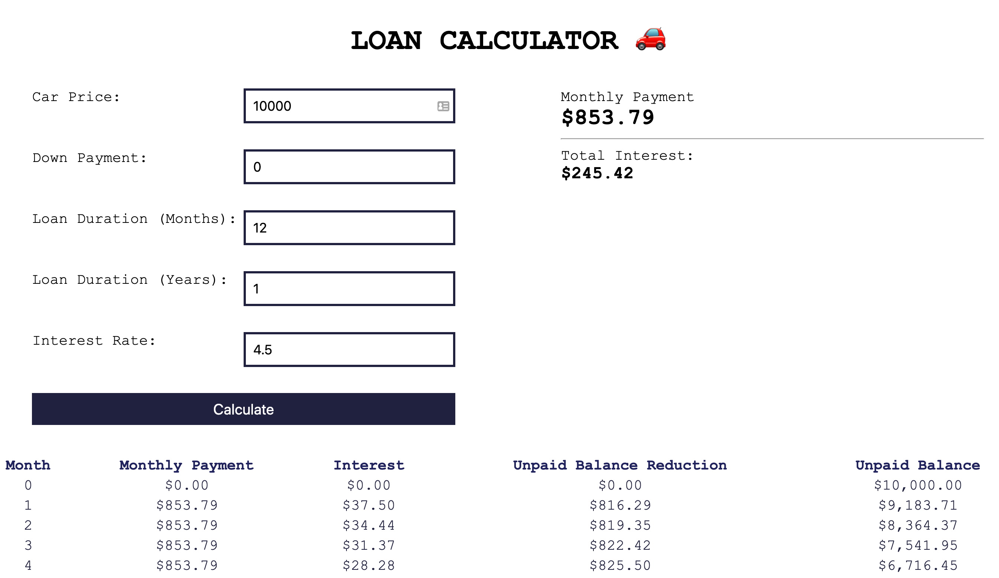

# Loan Calculator 🚗

This App calculates the monthly payment for a car loan. It will also give you the total interests and the amortization table.

## How to run it
 - Clone the repository
 - Install the dependencies with `npm install`
 - Start the App with `npm start`. This will start a server at port **8080**.

 
